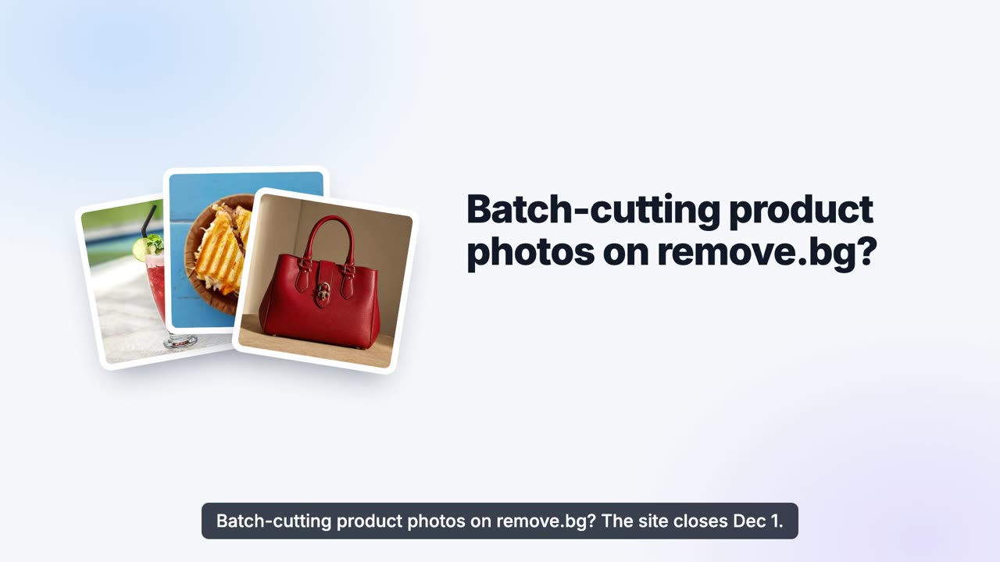

# remove.bg API migration: switch to PixMiller before 1 December 2026

[](https://github.com/PixMiller/remove-bg-migration/actions/workflows/examples.yml)
[](LICENSE)

English · [简体中文](README.zh-CN.md)

**remove.bg's self-service API stops accepting requests on 1 December 2026.** This repository
helps you move a remove.bg background-removal integration to
[PixMiller](https://pixmiller.com/en/remove-bg-alternative/?utm_source=github&utm_medium=referral&utm_campaign=removebg-migration&utm_content=readme_intro).
PixMiller serves a **remove.bg-compatible endpoint**, `POST /v1.0/removebg`: the same
`X-Api-Key` header, the same form fields, `200` with the image bytes, the same `X-*` headers
and the same error envelope.

It contains:

- a migration guide that lists **every difference** up front;
- copy-paste examples in 7 languages, tested in CI;
- a script that finds every remove.bg call in your codebase;
- an **AI agent skill** that does the migration for you in Claude Code, Codex, Cursor and others.

```diff
- curl -X POST "https://api.remove.bg/v1.0/removebg" \
-   -H "X-Api-Key: $REMOVEBG_KEY" \
+ curl -X POST "https://api.pixmiller.com/v1.0/removebg" \
+   -H "X-Api-Key: $PIXMILLER_API_KEY" \
    -F "image_file=@product.jpg" \
    -F "size=auto" \
    -o out.png
```

If your code calls the API with its own HTTP client, the usual change is the **base URL and the
key**. It is not a guaranteed drop-in for remove.bg's official SDKs.
[Read the differences](#what-is-different) before you switch.

## What is happening to remove.bg

| | |
|---|---|
| **1 Dec 2026, 09:00 CET** | The standalone remove.bg website closes. Background removal moves to Canva. |
| **Self-service API** | Stops accepting requests the same day. remove.bg points users to Leonardo.Ai, whose migration guide requires code changes: a new endpoint, Bearer auth and a JSON request body. |
| **Unused pay-as-you-go credits** | remove.bg says they expire when the site closes. |
| **Enterprise API contracts** | Not affected, according to remove.bg. |

Sources: the [remove.bg](https://www.remove.bg/) site banner and the [remove.bg API page](https://www.remove.bg/api), checked 1 October 2026.

## Quick start (5 minutes)

1. **Create an account:** [pixmiller.com/accounts/signup](https://pixmiller.com/accounts/signup/?utm_source=github&utm_medium=referral&utm_campaign=removebg-migration&utm_content=readme_quickstart). Email or Google.
2. **Copy your API key:** [pixmiller.com/users/~api](https://pixmiller.com/en/users/~api/?utm_source=github&utm_medium=referral&utm_campaign=removebg-migration&utm_content=readme_quickstart), then check it. This call is free:

   ```bash
   export PIXMILLER_API_KEY="..."
   curl -s https://api.pixmiller.com/v1.0/account -H "X-Api-Key: $PIXMILLER_API_KEY"
   ```

3. **Change the base URL and key, and set `size`** (`auto` or a paid tier, see below). Previews
   are free, so you can test before you
   [buy credits](https://pixmiller.com/en/pricing/?utm_source=github&utm_medium=referral&utm_campaign=removebg-migration&utm_content=readme_quickstart).
   Pay-as-you-go credits never expire.

Step-by-step guide: [docs/getting-started.md](docs/getting-started.md).

## What is the same

- Path `/v1.0/removebg`, the `X-Api-Key` header, and multipart, form or JSON bodies.
- `image_file`, `image_url`, `image_file_b64`, `format` (incl. `zip`), `crop`, `crop_margin`,
  `roi`, `scale`, `position`, `channels`, `bg_color`, `bg_image_file`, `bg_image_url`.
- `200 OK` with the image bytes, or the base64 envelope with `Accept: application/json`.
- `X-Credits-Charged`, `X-Width`, `X-Height`, `X-Type`, `X-Foreground-*`, `X-RateLimit-*`.
- `{"errors":[{"code","title"}]}`, with remove.bg's status codes and error codes.
- `GET /v1.0/account` with `data.attributes.credits`.

## What is different

> [!IMPORTANT]
> 1. **`size` defaults to `preview`, which is a free, watermarked image up to 640 px.** Send
>    `size=auto` (full resolution while credits last) or `full` / `hd` / `4k` / `medium` /
>    `50MP` (1 credit each). `regular`, the PyPI SDK default, is the watermarked preview too.
> 2. **40 images per minute per key** (remove.bg: 500). Handle `429` with `Retry-After`.
> 3. **Shadows (`add_shadow`, `shadow_*`) and `semitransparency` are accepted but not rendered.**
> 4. **Max input 20 MB** (remove.bg: 22 MB). There are no free monthly HD calls; previews are
>    free with no quota.
> 5. `X-Type` is a coarse class: `person`, `product`, `animal`, `car` or `other`.
> 6. **No SDK-level compatibility promise.** The PyPI `removebg`, npm `remove.bg` and
>    `removebg-cli` clients passed our tests on 2026-09-22, but we do not re-test them on every
>    release. See [docs/client-libraries.md](docs/client-libraries.md).

Full parameter, header and error reference: [docs/migration-guide.md](docs/migration-guide.md).

## Examples

All of them read `PIXMILLER_API_KEY`, send `size=auto`, retry on `429` and print remove.bg-style
errors. CI runs them on every push against a contract stub.

| Language | File | Run |
|---|---|---|
| curl | [examples/curl/remove-background.sh](examples/curl/remove-background.sh) | `./remove-background.sh in.jpg out.png` |
| Python | [examples/python/remove_background.py](examples/python/remove_background.py) | `python remove_background.py in.jpg out.png` |
| Python (batch, rate-limited) | [examples/python/batch_remove_bg.py](examples/python/batch_remove_bg.py) | `python batch_remove_bg.py ./in ./out` |
| Python (keep the `removebg` SDK) | [examples/python/patch_removebg_sdk.py](examples/python/patch_removebg_sdk.py) | `python patch_removebg_sdk.py in.jpg` |
| Node.js 18+ | [examples/node/remove-background.mjs](examples/node/remove-background.mjs) | `node remove-background.mjs in.jpg out.png` |
| PHP | [examples/php/remove-background.php](examples/php/remove-background.php) | `php remove-background.php in.jpg out.png` |
| Go | [examples/go/main.go](examples/go/main.go) | `go run . in.jpg out.png` |
| Ruby | [examples/ruby/remove_background.rb](examples/ruby/remove_background.rb) | `ruby remove_background.rb in.jpg out.png` |
| Java 11+ | [examples/java/RemoveBackground.java](examples/java/RemoveBackground.java) | `java RemoveBackground.java in.jpg out.png` |

## Let an AI agent do the migration

The [`remove-bg-migration`](skills/remove-bg-migration/SKILL.md) skill teaches a coding agent
the whole job. It finds every call site, classifies each integration (raw HTTP, PyPI `removebg`,
npm `remove.bg`, CLI or no-code), walks you through the account and key, edits the code, and
verifies the result **without spending credits**. It asks before any paid call and never
touches your key.

**Claude Code**

```text
/plugin marketplace add PixMiller/remove-bg-migration
/plugin install remove-bg-migration@pixmiller
```

**Any agent supported by [skills.sh](https://skills.sh)** (Claude Code, Codex, Cursor, Gemini CLI,
GitHub Copilot, Windsurf, …)

```bash
npx skills add PixMiller/remove-bg-migration
```

**Manual:** copy [`skills/remove-bg-migration`](skills/remove-bg-migration) into
`~/.claude/skills/` (Claude Code) or `~/.agents/skills/` (Codex and other agents).

Then ask: *"Migrate this project from remove.bg to PixMiller."*

## Tools

| Script | What it does | Cost |
|---|---|---|
| [`scripts/find-removebg-usages.sh`](scripts/find-removebg-usages.sh) | Lists remove.bg endpoints, SDK imports, key variables and `size` values in a codebase | read-only |
| [`scripts/verify-key.sh`](scripts/verify-key.sh) | Checks the key and makes one preview call | free |
| [`scripts/smoke-test.sh`](scripts/smoke-test.sh) | Checks auth, preview, JSON envelope and error codes; `--paid` adds one full-resolution call | free, or 1 credit with `--paid` |

```bash
# Scan your project without cloning this repo
bash <(curl -fsSL https://raw.githubusercontent.com/PixMiller/remove-bg-migration/main/scripts/find-removebg-usages.sh) /path/to/project
```

## Videos

| | |
|---|---|
| [](https://github.com/PixMiller/remove-bg-migration/releases/download/v1.0.0/removebg-api-en.mp4) | [](https://github.com/PixMiller/remove-bg-migration/releases/download/v1.0.0/removebg-api-zh.mp4) |
| **API migration in 60 s** (developers) | **API 迁移（中文，53 秒）** |
| [](https://github.com/PixMiller/remove-bg-migration/releases/download/v1.0.0/removebg-web-en.mp4) | [](https://github.com/PixMiller/remove-bg-migration/releases/download/v1.0.0/batch-switch-en.mp4) |
| **Website users: switch in 38 s** | **Batch users: 50 images at a time** |

## Not a developer?

If you used the remove.bg website rather than the API:

- Single images: [pixmiller.com/remove-bg-alternative](https://pixmiller.com/en/remove-bg-alternative/?utm_source=github&utm_medium=referral&utm_campaign=removebg-migration&utm_content=readme_web).
  The preview is free, and you pay only when you download HD.
- Up to 50 images at once: the [batch background remover](https://pixmiller.com/en/remove-background/batch/?utm_source=github&utm_medium=referral&utm_campaign=removebg-migration&utm_content=readme_web).
  It takes loose files or a ZIP and keeps the original file names.
- PixMiller is available in 12 languages and accepts card, PayPal, Alipay and WeChat Pay.

## Documentation

- [Getting started](docs/getting-started.md): account, API key, credits
- [Migration guide](docs/migration-guide.md): every parameter, header and error code
- [Client libraries](docs/client-libraries.md): PyPI `removebg`, npm `remove.bg`, `removebg-cli`, Zapier, Make, n8n
- [Production checklist](docs/production-checklist.md): rollout, rate limits, monitoring
- [FAQ](docs/faq.md)
- Official guide on the website: [pixmiller.com/api-docs/remove-bg-migration](https://pixmiller.com/en/api-docs/remove-bg-migration/?utm_source=github&utm_medium=referral&utm_campaign=removebg-migration&utm_content=readme_docs)

## Contributing

Did you migrate a library, framework or no-code tool that is not covered here? Pull requests
with tested examples are welcome. If something in this repo disagrees with the API's real
behaviour, please [open an issue](https://github.com/PixMiller/remove-bg-migration/issues).
To run the example tests locally, use `./tests/run-examples.sh`. It needs no API key.

## License and disclaimer

Code and docs are released under the [MIT License](LICENSE). The videos in the
[releases](https://github.com/PixMiller/remove-bg-migration/releases) are © Ullr AI Lab.

PixMiller is not affiliated with remove.bg, Canva or Leonardo.Ai. Product names are used for
identification only. Facts about those services are quoted from their public pages as of
September–October 2026.
