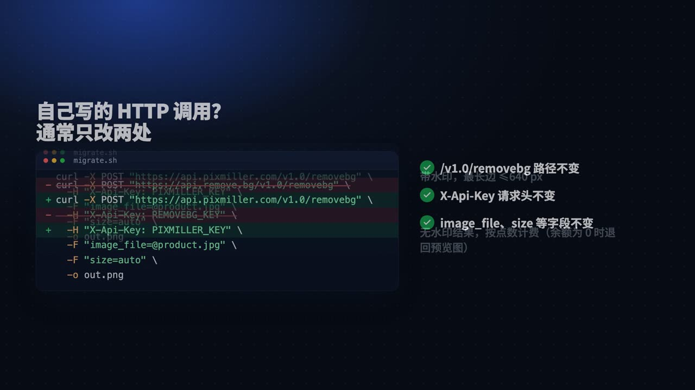
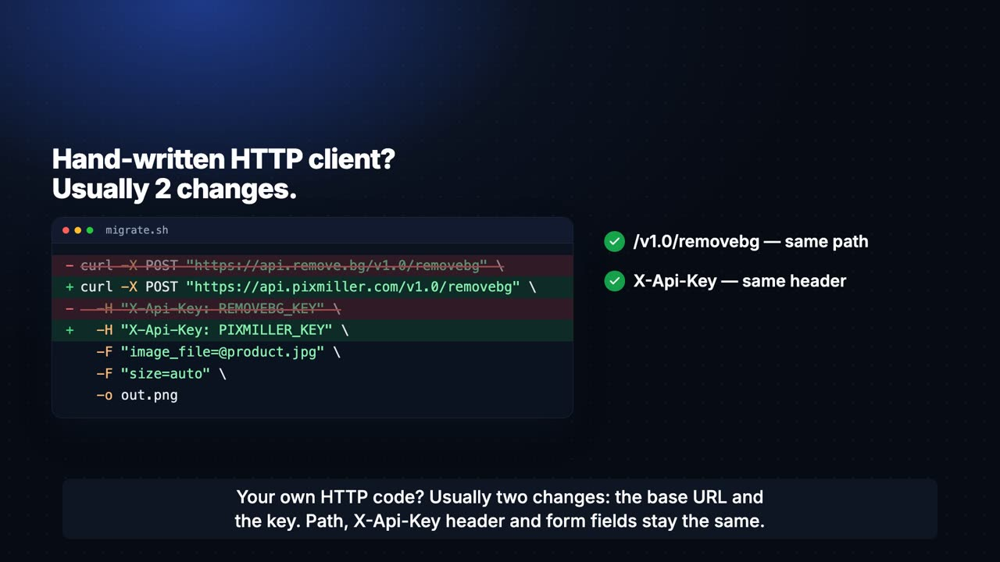

# remove.bg API 迁移：2026 年 12 月 1 日前切换到 PixMiller

[](https://github.com/PixMiller/remove-bg-migration/actions/workflows/examples.yml)
[](LICENSE)

[English](README.md) · 简体中文

**remove.bg 的自助 API 将于 2026 年 12 月 1 日停止受理请求。** 这个仓库帮你把调用 remove.bg
抠图（去背景）API 的代码迁移到
[PixMiller](https://pixmiller.com/zh-hans/remove-bg-alternative/?utm_source=github&utm_medium=referral&utm_campaign=removebg-migration&utm_content=readme_zh_intro)。
PixMiller 提供一个与 remove.bg 兼容的端点 `POST /v1.0/removebg`：请求头同样是 `X-Api-Key`，
表单字段同名，成功时同样返回 `200` 和图片字节，`X-*` 响应头和错误信封的格式也相同。

仓库里有：

- 迁移指南，把**所有差异**写在最前面；
- 7 种语言的示例代码，每次提交都会在 CI 里跑一遍；
- 一个扫描脚本，帮你找出代码库里所有调用 remove.bg 的位置；
- 一个 **AI Agent 技能（skill）**，可以在 Claude Code、Codex、Cursor 等工具里替你完成迁移。

```diff
- curl -X POST "https://api.remove.bg/v1.0/removebg" \
-   -H "X-Api-Key: $REMOVEBG_KEY" \
+ curl -X POST "https://api.pixmiller.com/v1.0/removebg" \
+   -H "X-Api-Key: $PIXMILLER_API_KEY" \
    -F "image_file=@product.jpg" \
    -F "size=auto" \
    -o out.png
```

如果你的代码自己发 HTTP 请求，通常只需要改 **base URL 和 API Key** 两处。但这不等于能保证
remove.bg 官方 SDK 原样可用。切换之前，请先看完下面的[差异](#有哪些不一样)。

## remove.bg 发生了什么

| 事项 | 说明 |
|---|---|
| **2026-12-01 09:00（欧洲中部时间）** | remove.bg 独立网站关闭，抠图功能并入 Canva。 |
| **自助 API** | 同一天停止受理请求。remove.bg 把 API 用户指向 Leonardo.Ai，而后者的迁移指南写明要改代码：换端点、改用 Bearer 认证、请求体改成 JSON。 |
| **未用完的按量（PAYG）点数** | remove.bg 表示关站时作废。 |
| **企业版 API 合同** | remove.bg 表示不受影响。 |

来源：[remove.bg](https://www.remove.bg/) 全站横幅与 [remove.bg API 页面](https://www.remove.bg/api)，2026 年 10 月 1 日核对。

## 五分钟上手

1. **注册账号**：[pixmiller.com/accounts/signup](https://pixmiller.com/accounts/signup/?utm_source=github&utm_medium=referral&utm_campaign=removebg-migration&utm_content=readme_zh_quickstart)。支持邮箱、Google，中文站还支持微信扫码。
2. **复制 API Key**：打开 [pixmiller.com/zh-hans/users/~api](https://pixmiller.com/zh-hans/users/~api/?utm_source=github&utm_medium=referral&utm_campaign=removebg-migration&utm_content=readme_zh_quickstart)，然后验证一下。下面这个调用不收费：

   ```bash
   export PIXMILLER_API_KEY="..."
   curl -s https://api.pixmiller.com/v1.0/account -H "X-Api-Key: $PIXMILLER_API_KEY"
   ```

3. **改 base URL 和 Key，并显式传 `size`**（`auto` 或付费档位，见下文）。预览档免费，所以可以先调通再
   [购买点数](https://pixmiller.com/zh-hans/pricing/?utm_source=github&utm_medium=referral&utm_campaign=removebg-migration&utm_content=readme_zh_quickstart)。
   按量购买的点数永不过期。

详细步骤见 [docs/zh-CN/getting-started.md](docs/zh-CN/getting-started.md)。

## 哪些保持不变

- 路径 `/v1.0/removebg`、请求头 `X-Api-Key`，multipart、表单和 JSON 三种请求体都支持。
- `image_file`、`image_url`、`image_file_b64`、`format`（含 `zip`）、`crop`、`crop_margin`、
  `roi`、`scale`、`position`、`channels`、`bg_color`、`bg_image_file`、`bg_image_url`。
- 成功时返回 `200` 和图片字节；带 `Accept: application/json` 时返回 base64 信封。
- `X-Credits-Charged`、`X-Width`、`X-Height`、`X-Type`、`X-Foreground-*`、`X-RateLimit-*`。
- 错误信封 `{"errors":[{"code","title"}]}`，状态码和错误码都沿用 remove.bg 的。
- `GET /v1.0/account`，余额在 `data.attributes.credits` 下。
- 支持浏览器端调用（已开启 CORS，不使用 cookie）。不要把 Key 写进公开的前端代码：请经你自己的后端转发，或让用户自带 Key。
  见[从浏览器调用](docs/zh-CN/migration-guide.md#从浏览器调用)。

## 有哪些不一样

> [!IMPORTANT]
> 1. **`size` 默认是 `preview`，在这里返回的是免费、带水印、最长边不超过 640 px 的预览图。**
>    要无水印原图，请传 `size=auto`（有点数时出原图），或 `full` / `hd` / `4k` / `medium` /
>    `50MP`（每张 1 点）。PyPI SDK 的默认值 `regular` 也属于带水印的预览档。
> 2. **每个 Key 每分钟最多 40 张**（remove.bg 是 500）。收到 `429` 时按 `Retry-After` 等待后重试。
> 3. **阴影参数（`add_shadow`、`shadow_*`）和 `semitransparency` 只校验，不生效。**
> 4. **输入文件最大 20 MB**（remove.bg 是 22 MB）。没有每月免费的高清调用，但预览档免费，也不设额度。
> 5. `X-Type` 只给粗分类：`person`、`product`、`animal`、`car`、`other`。
> 6. **不承诺 SDK 级兼容。** PyPI `removebg`、npm `remove.bg`、`removebg-cli` 三个客户端在
>    2026-09-22 的测试中跑通了主路径，但之后的每次发版不再逐一回归。详见
>    [docs/zh-CN/client-libraries.md](docs/zh-CN/client-libraries.md)。

完整的参数、响应头和错误码对照见 [docs/zh-CN/migration-guide.md](docs/zh-CN/migration-guide.md)。

## 示例代码

每个示例都从 `PIXMILLER_API_KEY` 读取 Key，默认传 `size=auto`，遇到 `429` 会自动重试，出错时按
remove.bg 的格式打印错误码。CI 每次提交都会对着契约模拟服务把它们全部跑一遍。

| 语言 | 文件 |
|---|---|
| curl | [examples/curl/remove-background.sh](examples/curl/remove-background.sh) |
| Python | [examples/python/remove_background.py](examples/python/remove_background.py) |
| Python（批量处理，带限速） | [examples/python/batch_remove_bg.py](examples/python/batch_remove_bg.py) |
| Python（继续用 `removebg` SDK） | [examples/python/patch_removebg_sdk.py](examples/python/patch_removebg_sdk.py) |
| Node.js 18+ | [examples/node/remove-background.mjs](examples/node/remove-background.mjs) |
| PHP | [examples/php/remove-background.php](examples/php/remove-background.php) |
| Go | [examples/go/main.go](examples/go/main.go) |
| Ruby | [examples/ruby/remove_background.rb](examples/ruby/remove_background.rb) |
| Java 11+ | [examples/java/RemoveBackground.java](examples/java/RemoveBackground.java) |

## 让 AI Agent 替你迁移

[`remove-bg-migration`](skills/remove-bg-migration/SKILL.md) 技能会教会编码 Agent 完成整个迁移：

1. 找出所有调用点；
2. 判断每处集成的类型：自写 HTTP、PyPI `removebg`、npm `remove.bg`、命令行工具，还是无代码平台；
3. 引导你完成注册和获取 Key；
4. 修改代码；
5. 在**不花点数**的前提下验证结果。

任何收费调用之前它都会先征得你同意，也不会碰你的 Key。

**Claude Code**

```text
/plugin marketplace add PixMiller/remove-bg-migration
/plugin install remove-bg-migration@pixmiller
```

**[skills.sh](https://skills.sh) 支持的其他 Agent**（Claude Code、Codex、Cursor、Gemini CLI、GitHub Copilot 等）

```bash
npx skills add PixMiller/remove-bg-migration
```

**手动安装**：把 [`skills/remove-bg-migration`](skills/remove-bg-migration) 复制到
`~/.claude/skills/`（Claude Code）或 `~/.agents/skills/`（Codex 等）。

装好后直接说：「把这个项目从 remove.bg 迁移到 PixMiller。」

## 工具脚本

| 脚本 | 作用 | 费用 |
|---|---|---|
| [`scripts/find-removebg-usages.sh`](scripts/find-removebg-usages.sh) | 列出代码库里的 remove.bg 端点、SDK 引用、Key 变量和 `size` 取值 | 只读 |
| [`scripts/verify-key.sh`](scripts/verify-key.sh) | 校验 Key，并调用一次预览档 | 免费 |
| [`scripts/smoke-test.sh`](scripts/smoke-test.sh) | 检查认证、预览、JSON 信封和错误码；加 `--paid` 会多调用一次原图 | 免费；带 `--paid` 扣 1 点 |

## 视频

| | |
|---|---|
| [](https://github.com/PixMiller/remove-bg-migration/releases/download/v1.0.0/removebg-api-zh.mp4) | [](https://github.com/PixMiller/remove-bg-migration/releases/download/v1.0.0/removebg-api-en.mp4) |
| **API 迁移（中文，53 秒）** | **API migration（英文，60 秒）** |

另有两条英文视频，面向网页用户和批量用户，见[英文 README](README.md#videos)。

## 不写代码？

如果你用的是 remove.bg 网页版而不是 API：

- 单张图片：用 [pixmiller.com/zh-hans/remove-bg-alternative](https://pixmiller.com/zh-hans/remove-bg-alternative/?utm_source=github&utm_medium=referral&utm_campaign=removebg-migration&utm_content=readme_zh_web)。预览免费，下载高清图时才付费。
- 一次最多 50 张：用[批量抠图](https://pixmiller.com/zh-hans/remove-background/batch/?utm_source=github&utm_medium=referral&utm_campaign=removebg-migration&utm_content=readme_zh_web)。支持直接拖入多张图片或上传 ZIP，导出时保留原文件名。
- 支持支付宝、微信支付、银行卡和 PayPal。

## 文档

- [快速上手](docs/zh-CN/getting-started.md)：注册、获取 Key、购买点数
- [迁移指南](docs/zh-CN/migration-guide.md)：所有参数、响应头和错误码
- [客户端库](docs/zh-CN/client-libraries.md)：PyPI `removebg`、npm `remove.bg`、`removebg-cli`，以及 Zapier、Make、n8n
- [上线检查清单](docs/zh-CN/production-checklist.md)：灰度切换、限速、监控
- [常见问题](docs/zh-CN/faq.md)
- 官网迁移指南：[pixmiller.com/zh-hans/api-docs/remove-bg-migration](https://pixmiller.com/zh-hans/api-docs/remove-bg-migration/?utm_source=github&utm_medium=referral&utm_campaign=removebg-migration&utm_content=readme_zh_docs)

## 参与贡献

迁移了这里还没覆盖的库、框架或无代码工具？欢迎提交附带测试示例的 PR。如果发现仓库内容和 API
的实际行为不一致，请[提 issue](https://github.com/PixMiller/remove-bg-migration/issues)。
在本地运行 `./tests/run-examples.sh` 就能测试全部示例，不需要 API Key。

## 许可与声明

代码和文档以 [MIT 许可证](LICENSE)发布。[Releases](https://github.com/PixMiller/remove-bg-migration/releases)
中的视频版权归 Ullr AI Lab 所有。

PixMiller 与 remove.bg、Canva、Leonardo.Ai 均无隶属关系，文中提及的产品名称仅用于指代。
有关这些服务的信息均引自其 2026 年 9～10 月的公开页面。
